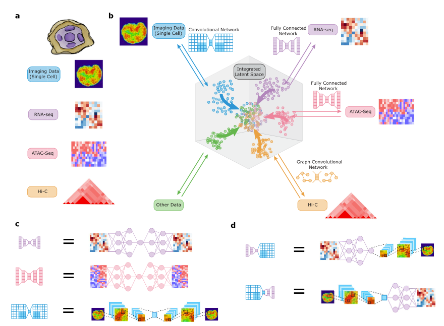
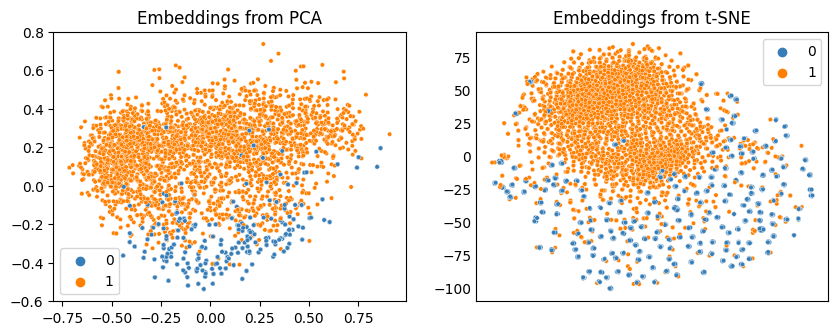
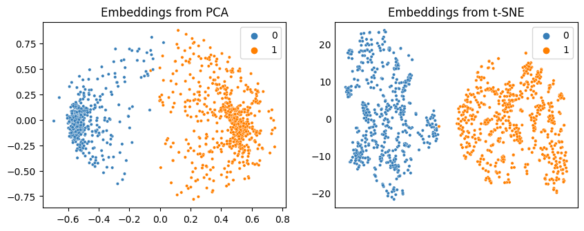
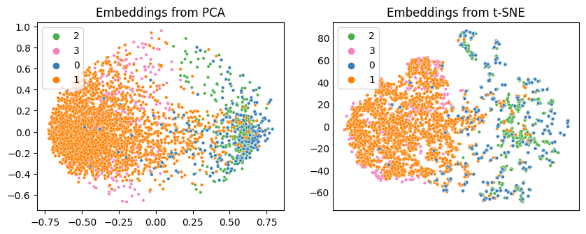

# PyFlow_DomainTranslation: 
##### Author: Talip Ucar (ucabtuc@gmail.com)

Pytorch implementation of "Multi-domain translation between single-cell imaging and sequencing data using 
autoencoders" (https://www.nature.com/articles/s41467-020-20249-2) with custom models. 
Two autoencoders are trained to learn a shared latent representation between two modalities (Chromatin Images and 
Single-cell RNA sequence). 

Each autoencoder is trained to learn representation of one modality while either a Discriminator with adversarial loss, 
or a classifier with cross-entropy loss is trained on the samples in the latent space to align the latent representations 
of two modalities. This results in learning a common latent representation for both modalities. 

Once trained, we can translate data from one domain to another, or fill in the missing data in one modality 
by using the available data in another.

If you are in hurry, and just want to clone the project and run it, move to [Summary](#summary) section. Otherwise, read on...



<sup>Source: https://www.nature.com/articles/s41467-020-20249-2 </sub>
# Model
There are two Autoencoders. 
1) A custom CNN-based Autoencoder model is used to learn representation from images. 
Its architecture is defined in yaml file of the model ("./config/ae.yaml"). 

Example: 
<pre>
conv_dims:                        # Architecture for Encoder and Decoder (in reverse order) with convolutional layers
  - [ 1,  64, 4, 2, 1, 1]         # i=input channel, o=output channel, k = kernel, s = stride, p = padding, d = dilation
  - [64,  64, 4, 2, 1, 1]         # [i, o, k, s, p, d]
  - [64, 128, 4, 2, 1, 1]         # [i, o, k, s, p, d]
  - [128, 256, 4, 2, 1, 1]        # [i, o, k, s, p, d]
  - 128                           # Dimension of bottleneck layer 
</pre>

```conv_dims``` defines first 3 convolutional layer as well as dimension of the latent variable, z. You can change this architecture
by modifying it in yaml file. You can add more layers, or change the dimensions of existing ones. 
Architecture is agnostic to input image size.

2)  A custom fully-connected Autoencoder model is used to learn representation from single-cell RNA sequence data. 
Its architecture is defined in yaml file of the model ("./config/ae.yaml"). 

Example:
<pre>
dims:                             # Autoencoder architecture - This is for Encoder, and Decoder (in reverse order)
  - 7633                          # Input dimension = number of features in the dataset
  - 1024                          # Hidden layer
  - 512                           # Hidden layer 
  - 128                           # Bottleneck layer
</pre>

3) 
    I) A discriminator that can be used to compare samples from the latent layers of two Autoencoders, and align 
    corresponding clusters of two domain in latent space. It is a four layer fully-connected neural network with 
    128 hidden dimensions in each layer, which can be change under "utils>model_utils.py"

    II) A classifier that can be trained on samples from the latent layers of two Autoencoders, and align corresponding 
    clusters of two domain in latent space. It is a four layer fully-connected neural network with 128 hidden dimensions 
    in each layer, which can be change under "utils>model_utils.py"

We can use either the discriminator with adversarial loss, or classifier with cross-entropy loss to align the latent 
space of two modalities. You can define which mode to use by changing "joint_training_mode: aae" option in "config>ae.yaml". 
<pre>
joint_training_mode: aae  # Use aae for adversarial training, 'sl' for supervised training i.e. cross-entropy loss.
</pre>

# Datasets
Following datasets are supported:
1. The RNA-seq data (https://support.10xgenomics.com/single-cell-gene-expression/datasets/2.1.0/pbmc8k)
2. The chromatin images (https://doi.org/10.5281/zenodo.4265737)

A CNN-based Autoencoder is trained on the chromatin images while a fully-connected one is trained on the RNA-seq data.

Data and pre-trained models are zipped and attached in the Github release. 
You can download the data (and the models if you would like) 
from : [Github release](https://github.com/talipucar/PyFlow_DomainTranslation/releases) 

Once downloaded, unzip the data, and place it under the main project directory. 
Unzipped model should be placed under **"./results/training/ae/"**


# Environment - Installation
It requires Python 3.8. You can set up the environment by following three steps:
1. Install pipenv using pip
2. Activate virtual environment
3. Install required packages 

Run following commands in order to set up the environment:
```
pip install pipenv          # To install pipenv if you don't have it already
pipenv shell                # To activate virtual env
pipenv install --skip-lock  # To install required packages. 
```

#### Important Note: 
If you want to use Python 3.7, follow these steps:
- Change python_version in Pipfile: ```python_version = "3.7"``` 
- Comment out torch and torchvision in Pipfile
- Install the packages as described above in 3 steps.
- Pip install torch and torchvision using following command line:
```pip install torch==1.5.0+cu101 torchvision==0.6.0+cu101 -f https://download.pytorch.org/whl/torch_stable.html```

You need to use this version of torch and torchvision if you want to use GPU when training. Other versions of torch with Python 3.7 
is not able to detect GPU even if it is available.

# Training
The training is done in two steps. 

I)  A CNN-based Autoencoder (AE) is pre-trained on the chromatin images for 500 epochs.
II) The pre-trained CNN-based AE is loaded, and a fully-connected AE is initialized together with a discriminator, or 
classifier. The fully-connected AE is trained in either adversarial, or cross-entropy loss, during which its latent 
space is aligned with that of CNN-based AE.

Commands for aforementioned two steps as well as for evaluation after training:
```
  I) python 0_train_ae.py      # Train autoencoder using the chromatin images
 II) python 1_train_joint.py   # Joint training of a second autoencoder using RNA-seq data together 
                               # with pre-trained Image autoencoder in (I) to align two domains.
III) python 2_eval.py          # Evaluations to test how aligned two domains are.
```

# Evaluation
## 1-Evaluation of latent spaces of two modalities with classification task
1. Logistic regression model is trained on the latent space of Image modality, using representations extracted from 
Encoder using training set for chromatic images. Then, the model is evaluated on samples translated from RNA-sequence data by using:  

RNA-seq training set &#x27F9; RNA Encoder &#x27F9; Image Decoder &#x27F9; Image Encoder &#x27F9; Samples translated from RNA domain

2. Same as step-1, but this time, the logistic regression is trained on the latent space of RNA-sequence, and 
evaluated on samples translated from Imsge data by using:  

The Chromatin images training set &#x27F9; Image Encoder &#x27F9; RNA Decoder &#x27F9; RNA Encoder &#x27F9; Samples translated from Image domain


## 2-Baseline Evaluation
Same classification task done in step-1 is repeated using untrained CNN-based Autoencoder for images.


## Running evaluation script
Once you have a trained model, you can evaluate the model performance by running:
```
python 2_eval.py
```

This will generate scatter plots of samples in latent space using PCA and T-SNE, in which we can observe how Image and RNA 
samples are aligned in the latent space. It will also report the results of classification task on the command screen.


For further details on what arguments you can use (or to add your own arguments), you can check out "/utils/arguments.py"


# Results

Results at the end of training is saved under "./results" directory. Results directory structure:

<pre>
results
    |-evaluation          # To save the results of evaluation script
        |-reconstructions # To save the results of inputs and their corresponding reconstruction
        |-clusters        # To save the results of scatter plots to show cllustering in each domain as well as the domain alignment. 
    |-training 
         |-model_name  
             |-model      # To save the models at the end of training.   
             |-plots      # To save the plots generated during training.   
             |-loss       # To save csv file containing losses recorded during training.
</pre>

You can save results of evaluations under "evaluation" folder.

## Performance with default parameters
1) Below are the results obtained using default models and hyper-paramters using adversarial training in the second step.

A) Classification Task:
<pre>
Results of Classification Task in "Latent Space":
    -Trained on latent of Image, tested on latent from: RNA encoder &#x27F9; Image decoder &#x27F9; Image encoder &#x27F9; latent
        Train score: 0.9616578014184397
        Test score:  0.6414930555555556
    -Trained on latent of RNA, tested on latent from: Image encoder &#x27F9; RNA decoder &#x27F9; RNA encoder &#x27F9; latent
        Train score: 1.0
        Test score:  0.9018173758865248
        
Results of Classification Task in "original data space i.e. raw data":
    -Trained on raw RNA features, tested on translations from image data: Images &#x27F9; Image encoder &#x27F9; RNA decoder
        Train score: 1.0
        Test score:  0.899822695035461
    -Trained on raw Image features, tested on translations from RNA data: RNA &#x27F9; RNA encoder &#x27F9; Image decoder
        Train score: 0.9993351063829787
        Test score:  0.9296875
</pre>
 
B) Confirming alignment using visualization:

First two plots below are showing samples of images and RNA data in their respective latent space to show that there are two 
clusters in each domain. Each figure the left and right sub-plots are obtained using PCA, and T-SNE respectively.


Figure-1: Image samples in the latent space of Image Autoencoder


Figure-2: RNA samples in the latent space of RNA Autoencoder


Below is the 2D visualization of samples from two domains in "Latent Space" (Left plot: PCA, Right plot: T-SNE). They 
show the samples obtained using 
<pre>
RNA data &#x27F9; RNA Encoder &#x27F9; Latent
Image data &#x27F9; Image Encoder &#x27F9; RNA Decoder &#x27F9; RNA Encoder &#x27F9; Latent
</pre>


Figure-3: The samples from RNA and Image domain are shown in the latent space of RNA Autoencoder. Legends (0,1) correspond 
to two clusters in the Image domain, and (2, 3) are for the ones in the RNA domain. 
Mapping of clusters are: 0 &#x27F9; 2, 1 &#x27F9; 3

# Experiment tracking
MLFlow can be used to track experiments. It is turned off by default, but can be turned on by changing option in 
runtime config file in "./config/runtime.yaml"

# Summary
1) Data and pre-trained models are zipped and attached in the Github release. 
After cloning the project, download the data (and the models if you would like) 
from : [Github release](https://github.com/talipucar/PyFlow_DomainTranslation/releases). Once downloaded, unzip the data, and place it under the main project directory. Unzipped model should be placed under "./results/training/ae/"


2) Installation of required packages:
```
pip install pipenv          # To install pipenv if you don't have it already
pipenv shell                # To activate virtual env
pipenv install --skip-lock  # To install required packages. 
```

3) Training and evaluation of the models:
```
  I) python 0_train_ae.py      # Train autoencoder using the chromatin images
 II) python 1_train_joint.py   # Joint training of a second autoencoder using RNA-seq data together 
                               # with pre-trained Image autoencoder in (I) to align two domains.
III) python 2_eval.py          # Evaluations to test how aligned two domains are.
```

If you want to use Python 3.7, please follow the steps described in [Important Note](#important-note).

# Citing this repo
If you use this work in your own studies, and work, you can cite it by using the following:
```
@misc{talip_ucar_2021_4482793,
    author       = {Talip Ucar},
    title        = {{Domain translation between single-cell imaging and sequencing data using autoencoders}},
    month        = Jan,
    year         = 2021,
    doi          = {10.5281/zenodo.4482793},
    version      = {1.0},
    publisher    = {Zenodo},
    url          = {https://doi.org/10.5281/zenodo.4482793}
    }
```

[](https://zenodo.org/badge/latestdoi/334516979)


